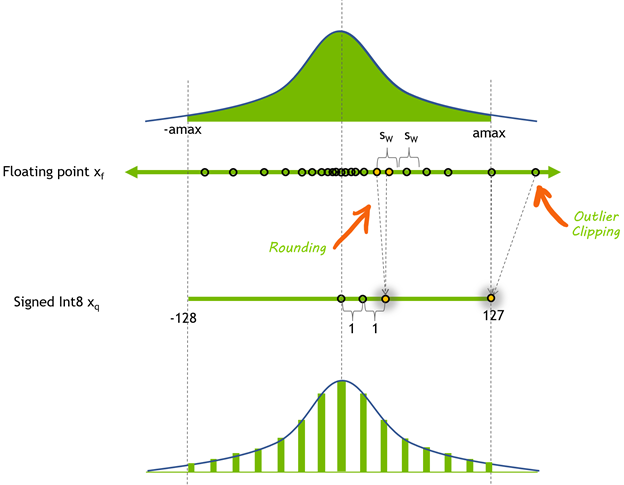

# Introduction
Quantization is a critical technique in the field of machine learning, aiming to optimize the performance and efficiency of neural network models. At its core, quantization involves reducing the precision of numerical values within the model, typically from floating-point representation to lower precision fixed-point representation. This reduction in precision helps to minimize the memory footprint of the model and accelerates inference speed, making it particularly beneficial for deployment on resource-constrained devices such as mobile phones or edge computing devices.

The motivation behind quantization stems from the need to strike a balance between model accuracy and computational efficiency. While deep learning models have achieved remarkable performance in various tasks, they often come with a high computational cost due to their large memory and computational requirements. Quantization addresses this challenge by trading off some level of precision for significant gains in model size reduction and inference speed, without substantially sacrificing model accuracy.

<br>

# Quantization Step Overview
Quantization involves three key stages to ensure the successful optimization of neural network models:

## Calibration:
- This stage involves analyzing a small subset or a portion of the training dataset.
- The weights and activations within the model are examined to understand their approximate distribution.
- Based on this distribution, quantization parameters such as scale factors and zero points are determined.
- The calibration process aims to strike a balance between preserving model accuracy and minimizing information loss due to quantization.

    

**Fig. 8-bit signed integer quantization of a floating-point tensor x_{f}. The symmetric dynamic range of x_{f} [-amax, amax] is mapped through quantization to [-128, 127]. (Source: Nvidia)**

## Testing:
- After quantization using the calibrated parameters, the model undergoes testing.
- The quantized model's performance is evaluated on a separate validation dataset.
- This stage ensures that quantization has not significantly degraded the model's performance compared to the original, unquantized version.

## Deployment:
- Once calibration and testing are successful, the quantized model is ready for deployment.
- The quantized model is integrated into production environments, considering factors like compatibility with hardware accelerators and optimization for inference speed and resource efficiency.

<br>

# Quantization Step Details

## Calibration

- **Purpose**: The calibration step is essential for determining the optimal quantization parameters that will be applied to the model. These parameters include scale factors and zero points, which dictate how floating-point values will be mapped to integer representations. Calibration ensures that the quantized model maintains acceptable accuracy while minimizing the loss of information due to quantization.

- **Methodology**: Calibration is typically performed by analyzing a subset of the data or a small training dataset. During this process, the distribution of weights and activations within the model is examined to understand their characteristics. Various techniques may be employed, such as histogram analysis or statistical methods, to estimate the parameters required for quantization.

- **Significance of Subset Data**: Using a subset of the data for calibration is crucial for several reasons. Firstly, it reduces the computational cost associated with analyzing the entire dataset, making the calibration process more efficient. Secondly, focusing on a subset allows for a representative sample of the data distribution to be captured, enabling accurate estimation of quantization parameters. Finally, it helps to ensure that the calibration process is scalable and feasible for large datasets.

## Testing
- **Evaluation**: The testing phase involves assessing the performance of the quantized model on a separate validation dataset. This is done to ensure that the quantization process has not significantly degraded the model's accuracy compared to the original, unquantized version. Metrics such as accuracy, precision, and inference speed are typically evaluated during testing.

- **Importance of Testing**: Testing is crucial for verifying the effectiveness of quantization and ensuring that the quantized model meets the desired performance criteria. It helps to identify any potential issues or degradation in model accuracy caused by quantization, allowing for adjustments to be made as needed.

- **Considerations**: During testing, specific considerations may include selecting an appropriate validation dataset that is representative of the model's intended use case, as well as ensuring that the testing environment accurately reflects the production environment. Techniques such as fine-tuning or retraining may also be employed to improve the performance of the quantized model if necessary.

## Deployment
- **Exporting Quantized Models**: After successful calibration and testing, the quantized model needs to be exported in a format suitable for deployment. This involves converting the quantized model into a format compatible with the target deployment environment. Two common formats for exporting quantized models are TorchScript (.pt) and XModel.

- **TorchScript Export**: Quantized models can be exported to TorchScript, a serialized representation of a PyTorch model that can be executed independently of the Python runtime. This enables seamless integration of the quantized model into production systems, as TorchScript models can be loaded and executed in various runtime environments, including C++, Java, and mobile platforms.

- **XModel Export**: XModel is another common format for exporting quantized models, particularly for deployment on edge devices or platforms that support the Xilinx Deep Learning Processor Unit (DPU). XModel encapsulates the quantized model along with any necessary metadata and optimizations for efficient execution on Xilinx FPGAs or other compatible hardware accelerators.
Code Walkthrough - ResNet50
Command-Line Arguments

<br>

# Code Walkthrough

## Command-Line Arguments

```python
parser = argparse.ArgumentParser()
parser.add_argument(
    '--config_file',
    default=None,
    help='quantization configuration file')
parser.add_argument(
    '--subset_len',
    default=None,
    type=int,
    help='subset_len to evaluate model, using the whole validation dataset if it is not set')
parser.add_argument(
    '--batch_size',
    default=8,
    type=int,
    help='input data batch size to evaluate model')
parser.add_argument('--quant_mode', 
    default='calib', 
    choices=['float', 'calib', 'test'], 
    help='quantization mode. 0: no quantization, evaluate float model, calib: quantize, test: evaluate quantized model')
parser.add_argument('--fast_finetune', 
    dest='fast_finetune',
    action='store_true',
    help='fast finetune model before calibration')
parser.add_argument('--deploy', 
    dest='deploy',
    action='store_true',
    help='export xmodel for deployment')

args, _ = parser.parse_known_args()
```

This script accepts the following command-line arguments:

- `--config_file` (optional, default: `None`): Path to the quantization configuration file. This file provides settings for the quantization process.

- `--subset_len` (optional, default: `None`): An integer value specifying the length of the subset to be used for evaluating the model. If not provided, the entire validation dataset is used.

- `--batch_size` (optional, default: `8`): An integer value specifying the batch size for input data during the evaluation process.

- `--quant_mode` (optional, default: `'calib'`): Specifies the quantization mode. Valid options are:
	- `'float'`: No quantization is performed, and the original float model is evaluated.
	- `'calib'`: The model is quantized, and the calibration process is performed.
	- `'test'`: The quantized model is evaluated.

- `--fast_finetune` (flag, optional, default: `False`): If set, the model is fine-tuned using the `fast_finetune` method before calibration.

- `--deploy` (flag, optional, default: `False`): If set, the quantized model is exported as an xmodel for deployment.


## Calibration
The calibration step is crucial for determining the optimal quantization parameters that will be applied to the model. These parameters include scale factors and zero points, which dictate how floating-point values will be mapped to integer representations. Calibration ensures that the quantized model maintains acceptable accuracy while minimizing the loss of information due to quantization.

### Need for a subset
During the calibration process, the script utilizes a subset of the dataset to analyze the distribution of weights and activations within the model. 

The code responsible for loading the subset is located in the `load_data` function:

```python
def load_data(train=True,
              batch_size=8,
              subset_len=None,
              sample_method='random',
              model_name='resnet50',
              **kwargs):

  # ...

  if train:
    dataset = train_dataset
    if subset_len:
      assert subset_len <= len(dataset)
      if sample_method == 'random':
        dataset = torch.utils.data.Subset(
            dataset, random.sample(range(0, len(dataset)), subset_len))
      else:
        dataset = torch.utils.data.Subset(dataset, list(range(subset_len)))
    # ...
```

In this function, if `subset_len` is provided, the code creates a `Subset` of the dataset using either random sampling or a sequential slice, depending on the sample_method argument.


### Calibration Process

The calibration process is performed within the `quantization` function:

```python
def quantization(title='optimize',
                 model_name='', 
                 file_path=''):

  quant_mode = args.quant_mode
  finetune = args.fast_finetune
  deploy = args.deploy
  batch_size = args.batch_size
  subset_len = args.subset_len
  config_file = args.config_file

  # ...

  if quant_mode == 'calib':
    quantizer = torch_quantizer(
        quant_mode, model, (input), device=device, quant_config_file=config_file)

    quant_model = quantizer.quant_model
```

When the `quant_mode` is set to `'calib'`, the code creates a `torch_quantizer` instance from the `pytorch_nndct.apis` module. This quantizer takes the quantization mode, the model, a sample input tensor, the device, and the quantization configuration file as arguments.

The quantizer performs the calibration process by analyzing the model's weights and activations using the provided subset of the dataset. It determines the appropriate scale factors and zero points for quantization, ensuring that the quantized model (`quant_model`) maintains acceptable accuracy while reducing the precision of numerical values.


## Testing
After the calibration process, the quantized model undergoes testing to evaluate its performance and ensure that the quantization has not significantly degraded the model's accuracy compared to the original, unquantized version.

The testing phase is handled within the `quantization` function, specifically in the following code block:

```python
def quantization(title='optimize',
                 model_name='', 
                 file_path=''):

  # ...

  # to get loss value after evaluation
  loss_fn = torch.nn.CrossEntropyLoss().to(device)

  val_loader, _ = load_data(
      subset_len=subset_len,
      train=False,
      batch_size=batch_size,
      sample_method='random',
      model_name=model_name)

  # fast finetune model or load finetuned parameter before test
  if finetune == True:
      ft_loader, _ = load_data(
          subset_len=10,
          train=False,
          batch_size=batch_size,
          sample_method='random',
          model_name=model_name)
      if quant_mode == 'calib':
        quantizer.fast_finetune(evaluate, (quant_model, ft_loader, loss_fn))
      elif quant_mode == 'test':
        quantizer.load_ft_param()
   
  # Evaluate -- Get training accuracy
  accuracy = evaluate(quant_model, val_loader, loss_fn)
  print(f"Accuracy: {accuracy:.4f}%")
```

1. **Preparation**: The code first defines a loss function (`CrossEntropyLoss`) and loads the validation data loader (`val_loader`) using the `load_data` function with the specified `subset_len`, `batch_size`, and `sample_method`.

2. **Fine-tuning (Optional)**: If the `fast_finetune` flag is set, the code performs an optional fine-tuning step before testing. It loads a separate data loader (`ft_loader`) with a fixed subset length of 10 samples. If the quantization mode is `'calib'`, the `fast_finetune` method of the quantizer is called with the `evaluate` function and the quantized model, fine-tuning data loader, and loss function as arguments. If the mode is `'test'`, the `load_ft_param` method is called to load the fine-tuned parameters.

3. **Evaluation**: The `evaluate` function is called with the quantized model (`quant_model`), the validation data loader (`val_loader`), and the loss function (`loss_fn`). This function calculates the accuracy of the quantized model on the validation dataset by iterating over the data loader, making predictions, and comparing them with the true labels.

4. **Output**: The calculated accuracy is printed to the console in the format `"Accuracy: {accuracy:.4f}%"`, where `{accuracy:.4f}` formats the accuracy value with four decimal places.

The testing phase is crucial for verifying the effectiveness of quantization and ensuring that the quantized model meets the desired performance criteria. By evaluating the quantized model on a separate validation dataset, any potential issues or degradation in model accuracy caused by quantization can be identified, allowing for adjustments or further fine-tuning if necessary.


## Deployment

After successful calibration and testing, the quantized model needs to be exported in a format suitable for deployment. This involves converting the quantized model into a format compatible with the target deployment environment. The script supports exporting the quantized model in two common formats: TorchScript (.pt) and XModel.

### TorchScript Export

The code responsible for exporting the quantized model to TorchScript is as follows:

```python
def quantization(title='optimize',
                 model_name='', 
                 file_path=''):

  # ...

  if deploy:
    quantizer.export_torch_script()
```

If the `deploy` flag is set, the `export_torch_script` method of the quantizer is called, which generates a TorchScript version of the quantized model.

### XModel Export

The code for exporting the quantized model as an XModel is:

```python
def quantization(title='optimize',
                 model_name='', 
                 file_path=''):

  # ...

  if deploy:
    quantizer.export_xmodel()
```

Similar to the TorchScript export, if the `deploy` flag is set, the `export_xmodel` method of the quantizer is called, which generates an XModel version of the quantized model.

The deployment step is critical for integrating the quantized model into production environments, ensuring compatibility with the target hardware and runtime environments. By exporting the quantized model in the appropriate format, such as TorchScript or XModel, the script facilitates the deployment process and enables efficient execution of the quantized model on various platforms.

<br>

# Usuage
The `resnet50_quant.py` script can be used for various purposes, including calibration, training, and testing of the ResNet50 model. The following examples illustrate how to use the script for different tasks:

## Calibration
To perform calibration of the ResNet50 model, use the `--quant_mode calib` argument along with the path to the quantization configuration file and the desired subset length:

```bash
python resnet50_quant.py --quant_mode calib --subset_len 20
```

This command will calibrate the ResNet50 model using the specified subset length of 20 samples.

> Note: In the calibration step, `subset_len` is set to a small value of 20 for quicker execution of the script. This allows you to observe results rapidly, making it suitable for demonstration purposes or quick evaluation.

## Testing (Quantized Model)
To evaluate the quantized ResNet50 model, use the `--quant_mode test` argument:

```bash
python resnet50_quant.py --quant_mode test --subset_len 20
```
This command will load the quantized model and evaluate its performance on a subset of 20 samples from the test dataset.

> Note: Similar to the calibration step, `subset_len` is set to a small value of 20 for quicker execution during the testing phase.

## Deployment
If you want to export the quantized model for deployment, you can use the `--deploy` flag along with the `--quant_mode test` argument:

```bash 
python resnet50_quant.py --quant_mode test --subset_len 1 --batch_size 1 --deploy
```
This command will export the quantized model in the TorchScript (.pt) and XModel formats, which can be used for deployment on various platforms and hardware accelerators.

> Note: For the deployment step, `subset_len` is set to 1, and `batch_size` is set to 1. This is because exporting the model for deployment typically requires only a single iteration of inference with a batch size of 1. This ensures that the exported model is properly configured for deployment scenarios.

For all the above usages, you can also specify additional arguments such as `--config_file` to provide a quantization configuration file or `--fast_finetune` to enable fast fine-tuning before calibration.

<br>

# Conclusion

This documentation provides an overview of the quantization process and a detailed walkthrough of the `resnet50_quant.py` script. The script is designed to quantize the ResNet50 model using the PyTorch-NNDCT API, with support for calibration, testing, and deployment of the quantized model.

The quantization process involves three main stages: calibration, testing, and deployment. The calibration step determines the optimal quantization parameters by analyzing a subset of the dataset, while the testing stage evaluates the quantized model's performance on a separate validation set. Finally, the deployment step exports the quantized model in formats suitable for deployment, such as TorchScript (.pt) and XModel.

The `resnet50_quant.py` script accepts various command-line arguments to control the quantization process, including specifying the quantization mode, subset length, batch size, and configuration file. Usage examples are provided for calibration, testing, and deployment, along with explanations for the chosen parameter values in each step.

## References

1. [Achieving FP32 Accuracy for INT8 Inference Using Quantization-Aware Training with TensorRT](https://developer.nvidia.com/blog/achieving-fp32-accuracy-for-int8-inference-using-quantization-aware-training-with-tensorrt/)
2. [Vitis AI User Guide (UG1414)](https://docs.xilinx.com/r/en-US/ug1414-vitis-ai)
3. [Vitis-AI/resnet18_quant.py](https://github.com/Xilinx/Vitis-AI/blob/master/src/vai_quantizer/vai_q_pytorch/example/resnet18_quant.py)

## Additional Information

The quantization process documented here can be applied to the Vitis AI Reference Tutorials repository, which includes ResNet50 along with other models. The repository can be found at [https://github.com/LogicTronix/Vitis-AI-Reference-Tutorials/tree/main/Quantizing-Resnet-Variants/ResNet50](https://github.com/LogicTronix/Vitis-AI-Reference-Tutorials/tree/main/Quantizing-Resnet-Variants/ResNet50).

By following the provided documentation and examples, users can effectively quantize and optimize their models for deployment on resource-constrained devices or hardware accelerators, achieving a balance between model accuracy and computational efficiency.